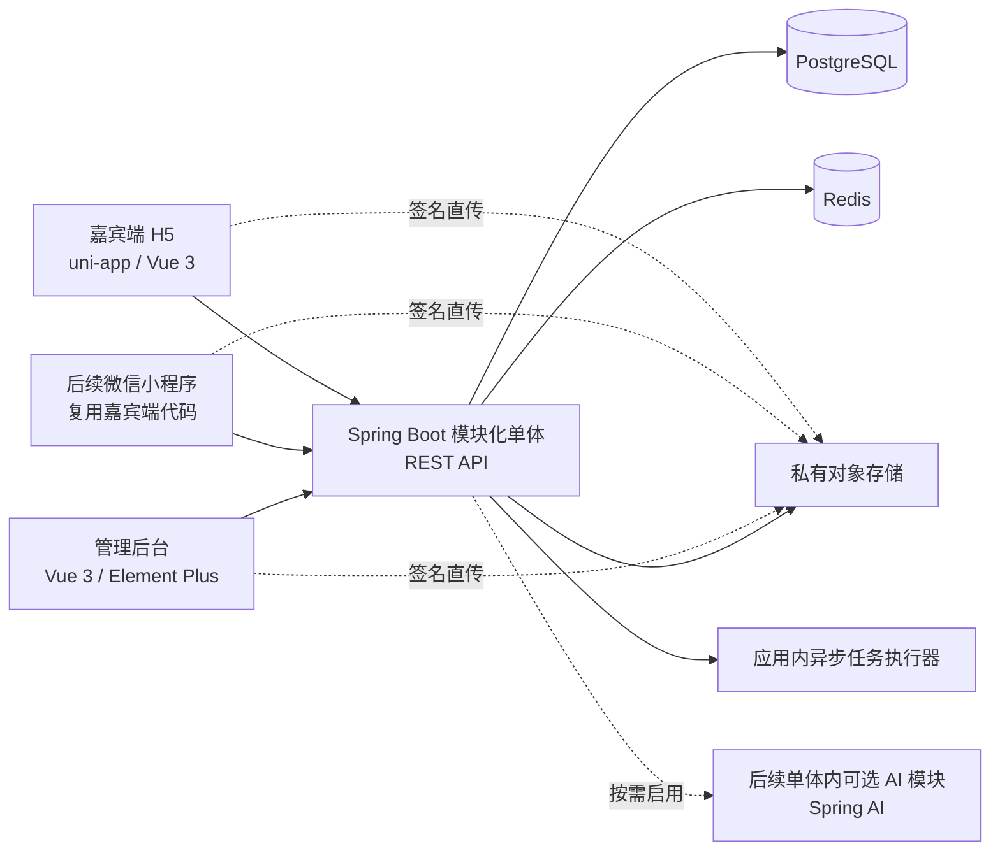

# 婚恋智能档案库技术架构设计

- 日期：2026-08-06
- 状态：已确认技术方向，待用户审阅本文档
- 依据：《婚恋智能档案库需求初稿》v0.3
- 适用范围：第一期 H5 嘉宾端、网页管理后台，以及后续微信小程序和 AI 能力的演进基础

## 1. 决策摘要

项目采用 Vue 技术体系与 Java 模块化单体架构：

| 层级 | 技术选择 |
| --- | --- |
| 嘉宾端 | uni-app、Vue 3、TypeScript，第一期发布 H5，后续适配微信小程序 |
| 管理后台 | Vue 3、TypeScript、Vite、Element Plus |
| 后端 | Java 25 LTS、Spring Boot 4.1.x、Spring MVC、Spring Modulith |
| 数据访问 | MyBatis-Plus 3.5.17+；单表使用内置方法和 Wrapper，复杂连表使用 Mapper 注解，不使用 XML |
| 数据库 | PostgreSQL 18 的当前受支持小版本 |
| 缓存与会话 | Redis，仅用于会话、限流、临时凭证、短期缓存和分布式协调 |
| 文件 | 国内云厂商私有对象存储，使用短时效签名地址 |
| 数据迁移 | Flyway |
| 安全 | Sa-Token 1.45.x、Redis 会话、Argon2id、字段级加密、最小权限和不可变审计日志 |
| 监控 | Spring Boot Actuator、Micrometer、结构化日志与告警 |
| AI 演进 | Spring AI 2.0.x，第一期不启用，后续作为隔离的 `ai` 模块按需引入 |
| 部署 | Docker；第一期使用少量应用实例，不引入 Kubernetes 和微服务体系 |

核心原则是先构建边界清晰、可测试、可审计的模块化单体。扩展性来自稳定的模块接口、数据所有权和事件契约，而不是提前拆分网络服务。

## 2. 目标与非目标

### 2.1 架构目标

1. 支撑手机号白名单、付费激活、档案填写、版本审核、素材管理、授权管理和朋友圈锐评闭环。
2. 保护手机号、微信号、照片、朋友圈素材和授权证据等敏感数据。
3. 保留档案版本、授权版本和关键操作记录，不允许静默覆盖历史数据。
4. H5、管理后台和后续微信小程序共用同一套业务接口与权限规则。
5. 在不重写核心系统的前提下增加 AI 辅助和独立的重型媒体处理能力。
6. 让熟悉 Java 的团队获得较低的维护成本、明确的事务边界和完整的可观测性。

### 2.2 第一期非目标

1. 不实现智能匹配、AI 推荐或自动评分。
2. 不实现在线支付、自动对账、短信验证码或邮箱验证码。
3. 不实现嘉宾公开浏览、嘉宾间聊天或联系方式交换。
4. 不拆分微服务，不引入 Kafka、Kubernetes 或独立搜索集群。
5. 不将 Redis 作为任何核心业务记录的永久数据源。
6. 不使用 Mapper XML，也不引入额外的连表查询插件。

## 3. 总体架构



所有客户端只调用后端公开的 REST API。客户端不得自行判断业务状态是否合法，后端是账号状态、档案状态、授权有效性、素材审核和权益使用规则的唯一事实来源。

## 4. 前端设计

### 4.1 嘉宾端

嘉宾端使用 uni-app、Vue 3 和 TypeScript。第一期输出 H5，后续输出微信小程序。页面、表单模型、校验规则和 API 客户端尽量共用，平台差异集中在适配层：

- `auth-adapter`：H5 会话与微信小程序令牌存储差异。
- `upload-adapter`：浏览器与小程序文件选择、压缩和直传差异。
- `navigation-adapter`：路由和返回行为差异。
- `privacy-adapter`：平台隐私授权与系统权限提示差异。

嘉宾端不复用管理后台组件库，避免桌面组件对移动端包体和交互造成限制。

### 4.2 管理后台

管理后台使用标准 Vue 3、TypeScript、Vite 和 Element Plus，重点支持复杂筛选、审核工作台、素材复核、权限管理和审计查询。管理端与嘉宾端共用 OpenAPI 生成的请求类型和通用枚举，但不共用页面组件。

### 4.3 API 契约

- REST API 统一使用 `/api/v1` 前缀。
- 使用 OpenAPI 维护契约并生成前端 TypeScript 类型。
- 时间统一传输 ISO 8601 格式，数据库保存带时区时间。
- 金额统一使用最小货币单位的整数或 PostgreSQL `numeric`，禁止浮点数。
- 状态枚举只能由后端返回并校验，前端不得构造未知状态。
- 错误响应包含稳定的业务错误码、面向用户的安全提示和请求追踪编号。

## 5. 后端模块边界

后端采用按业务能力划分的模块，而不是按 Controller、Service、Mapper 横向堆叠。每个模块拥有自己的实体、Mapper、服务和表访问权。

| 模块 | 职责 | 主要数据所有权 |
| --- | --- | --- |
| `identity` | 嘉宾账号、白名单、激活、密码、Sa-Token 会话、微信身份绑定、登录限流和密码重置 | `user_account`、`external_identity`、`activation_credential`、`password_reset_credential` |
| `guest` | 嘉宾主档、固定字段、动态字段定义与字段值 | `guest_profile`、`profile_field_definition`、`profile_field_value` |
| `review` | 草稿、提交版本、审核截止时间、退回和通过 | `profile_revision`、`profile_revision_field_value`、`profile_review_record` |
| `consent` | 授权书版本、主动同意、到期、续期和撤回 | `authorization_document`、`authorization_record`、`withdrawal_request` |
| `media` | 生活照片、朋友圈原始素材、处理素材、访问级别和审核 | `media_asset`、`media_relation`、`media_review_record` |
| `live_review` | 锐评权益、素材准备、排期、完成和发布记录 | `live_review_entitlement`、`live_review_event`、`published_asset_record` |
| `payment` | 线下付款、退款和经办信息 | `payment_record`、`refund_record` |
| `admin` | 工作人员、角色、权限和数据范围 | `admin_user`、`role`、`permission`、关联表 |
| `audit` | 敏感查看、修改、导出、删除和关键状态变更 | `audit_log` |
| `notification` | 审核超时、授权到期、排期和异常任务提醒 | `notification_task`、`notification_delivery` |
| `ai` | 后续模型调用、脱敏、提示词版本、结果和 AI 调用审计 | 第一期不建业务表；启用时独立建表 |

模块只能通过公开的应用服务接口和领域事件协作，禁止跨模块直接调用对方 Mapper。Spring Modulith 用于验证模块依赖方向、执行模块级集成测试并生成模块文档。

## 6. 数据与版本设计

### 6.1 嘉宾主档与动态字段

高频检索字段直接保存在 `guest_profile`：档案编号、性别、出生日期、身高、学历、职业、收入区间、城市和当前状态。这样可以建立明确索引并保持后台筛选性能。

可配置的低频扩展字段使用字段定义表和字段值表：

- 字段定义保存名称、类型、选项、启用状态、必填状态、排序和说明。
- 字段值保存档案、字段定义、数据类型和对应值。
- 停用字段不会物理删除历史值。
- 选项更新使用稳定选项编码，不以展示名称作为历史数据主键。

第一期不把所有档案字段塞入一个 JSON 文档，避免检索、约束、索引和历史版本管理失控。

### 6.2 档案版本

- `guest_profile` 只保存当前业务指针和当前已通过版本编号。
- 嘉宾保存草稿时更新当前草稿版本。
- 每次提交审核时固化一份不可变的 `profile_revision` 快照。
- 已通过档案发生修改时创建新版本，不覆盖当前已通过版本。
- 审核通过后，在同一事务中更新当前已通过版本指针和审核记录。
- 审核退回只改变待审版本状态，不影响最后一个已通过版本。
- 工作人员直接修改同样产生新版本，并记录修改原因和字段级差异。

版本快照优先保存完整业务快照，而不是只保存差量。这样读取任意历史版本不依赖回放所有差量，审计和恢复更可靠。

### 6.3 授权记录

- 授权书文案按版本不可变保存。
- 付款前通过不包含嘉宾隐私数据的版本化公开页面展示组合授权说明；付款记录关联当时提供的授权书版本。
- 激活时再次展示完整授权，嘉宾主动确认后才创建正式授权记录。
- 每次同意、续期和撤回产生新记录，不覆盖历史记录。
- 授权开始时间等于主动勾选并成功提交的服务端接收时间。
- 到期时间由服务端根据授权规则计算。
- 排期和素材使用在事务内再次校验当前授权状态，不能只依赖前端页面状态。
- 到期扫描用于提醒和状态刷新，但业务拦截必须实时计算，避免定时任务延迟形成绕过窗口。

### 6.4 敏感字段

- 手机号、微信号、抖音号等敏感字段采用应用层信封加密。
- 微信 `openid`、`unionid` 和授权取得的手机号按照个人信息保护，不出现在日志、前端错误或统计标签中。
- 等值检索额外保存标准化值的带密钥 HMAC 索引，不保存可逆明文索引。
- 密钥不写入代码、配置文件或数据库，生产环境使用云密钥管理服务或受控密钥注入。
- 普通日志、异常日志、链路标签和监控指标禁止记录完整敏感字段。

### 6.5 媒体文件

数据库只保存对象键、内容摘要、媒体类型、大小、状态和访问级别，不保存永久公开 URL。文件分为原始、已处理和已发布三类命名空间。客户端先从后端取得受限上传凭证，再直传私有对象存储；上传完成后由后端校验对象元数据并登记媒体记录。

## 7. MyBatis-Plus 数据访问规范

项目不维护 Mapper XML，规则如下：

1. 单表 CRUD 使用 `BaseMapper`、MyBatis-Plus 内置服务方法和 Lambda Wrapper。
2. 单表分页使用 MyBatis-Plus 分页插件。
3. 复杂连表查询在 Mapper 中使用 `@Select` 注解，SQL 使用 Java 文本块。
4. 条件较多的动态连表查询使用 `@SelectProvider`，仍以 Mapper 注解作为入口。
5. 复杂查询结果映射为明确的 Query DTO 或 View Object，不返回无类型的 Map。
6. 所有用户输入使用参数绑定；动态排序列和表意字段通过后端白名单映射，禁止直接插值。
7. 禁止循环内查询；关联数据采用批量查询或单次注解连表查询。
8. 注解 SQL 按具体用例拆分，禁止构造覆盖所有场景的万能查询。
9. 数据权限和业务权限由应用服务与统一权限组件控制，SQL 条件作为纵深防护，不能代替授权判断。
10. Flyway 管理 DDL、索引和数据修复脚本；DDL 不放入 Mapper 注解。
11. 注解 SQL 必须在真实 PostgreSQL 兼容环境中执行集成测试，因为 Java 编译无法校验 SQL 正确性。

## 8. 核心业务流程

### 8.1 付费激活

1. 管理员创建付款记录和待激活账号。
2. 系统生成高熵一次性初始凭证，只保存 Argon2id 哈希、有效期和使用状态。
3. 嘉宾提交手机号和初始凭证，接口返回统一错误信息，避免泄露白名单状态。
4. 校验成功后强制设置新密码，并在一个事务中使初始凭证失效、激活账号和创建审计记录。
5. 登录失败计数和临时锁定保存在 Redis；关键锁定和人工解锁同时写审计记录。

### 8.2 档案提交与审核

1. 嘉宾编辑草稿，后端按当前字段定义校验。
2. 提交时固化完整版本并计算 24 小时审核截止时间。
3. 工作人员审核时读取待审版本和最后已通过版本的差异。
4. 通过时原子更新当前版本指针；退回时保存结构化原因和可展示说明。
5. 审核超时扫描只负责提醒，不自动通过或改变业务结果。

### 8.3 素材上传与公开使用

1. 客户端申请受文件类型、大小、数量和对象键限制的短时上传凭证。
2. 客户端直传私有对象存储。
3. 后端确认上传并创建原始媒体记录。
4. 工作人员生成或上传处理版本，并完成独立人工复核。
5. 只有处理完成且审核通过、授权有效的素材可以关联到直播排期。
6. 每次下载、导出和查看原始素材均记录敏感访问审计。

### 8.4 授权到期与撤回

1. 定时任务生成到期提醒并更新展示状态。
2. 所有新排期、新编辑和新发布操作实时检查授权有效期与撤回状态。
3. 续期产生新的授权记录和有效期。
4. 撤回后立即禁止未来素材使用，并创建需要人工处理的账号、退款和删除任务。
5. 已发布内容的后续处理遵循当时生效的业务规则和法律审查结论。

## 9. 身份认证与权限

### 9.1 统一认证框架

- 使用 `sa-token-spring-boot4-starter`，不启用 Spring Security，也不维护第二套认证过滤器链。
- Sa-Token 使用 Redis 持久化登录态，令牌采用可撤销的随机不透明值，不以长期 JWT 作为唯一会话凭证。
- 嘉宾和后台工作人员使用两套独立的 `StpLogic` 登录类型、Token 名称、权限集合和会话策略。
- 嘉宾 H5 与微信小程序使用同一个内部 `user_account_id`，通过 Sa-Token 的设备类型区分 `h5` 与 `wechat-mini` 会话。
- 修改密码、暂停账号、完成注销或发生高风险事件时，使该账号全部相关会话失效。
- Sa-Token 负责登录态、角色、权限、设备会话、踢人下线和会话续期，不负责密码哈希或微信服务端身份交换。

### 9.2 H5 登录

- H5 延续白名单手机号、一次性初始凭证和首次强制改密流程。
- 密码与一次性凭证使用独立的 Argon2id 组件处理，不使用 Sa-Token 内置的通用摘要函数代替密码哈希。
- 后端验证账号后，以内部 `user_account_id` 创建 Sa-Token 嘉宾会话。
- H5 使用 `Secure`、`HttpOnly`、`SameSite=Lax` 的会话 Cookie，并保持前后端同站部署。
- 对所有状态变更请求校验 CSRF Token、`Origin` 和 `Referer`；Sa-Token 登录校验不能代替 CSRF 防护。

### 9.3 微信小程序登录与账号绑定

1. 小程序调用微信登录能力取得一次性 `code`，只把 `code` 发送给平台后端。
2. 后端使用服务端保存的 AppID 和 AppSecret 调用微信接口，换取 `openid`、会话信息和可能存在的 `unionid`；AppSecret 不得进入小程序包。
3. 后端以 `app_id + openid` 查询 `external_identity`。已绑定时，直接以对应 `user_account_id` 创建 `wechat-mini` 类型的 Sa-Token 会话。
4. 未绑定时，用户可以主动触发微信手机号授权。后端使用手机号授权 `code` 向微信服务端换取手机号，客户端提交的明文手机号不能作为可信绑定依据。
5. 微信取得的手机号只用于定位候选平台账号。首次绑定仍要求原账号密码、一次性初始凭证或管理员人工核验，不能仅凭手机号自动接管已有档案。
6. 绑定成功后创建 `external_identity`，以后登录不再重复要求手机号授权或平台密码。
7. 手机号不匹配、一个账号已绑定其他微信身份或一个微信身份关联其他账号时，进入人工处理，不自动覆盖。
8. 解绑、换绑和管理员修复必须二次认证并写入审计日志，同时使旧小程序会话失效。

`external_identity` 至少保存平台账号、供应方、小程序 AppID、加密的 OpenID、可选 UnionID、绑定手机号来源、绑定时间、解绑时间和状态，并建立供应方、AppID 与 OpenID HMAC 的唯一约束。微信授权手机号标记为 `WECHAT_AUTHORIZED` 来源，但不得标记为实名认证结果。微信昵称和头像只作为用户主动填写的可选展示资料，不能作为登录标识。

### 9.4 后台权限

- Sa-Token 负责后台认证、路由拦截、注解权限和角色校验。
- RBAC 控制功能权限，数据范围规则控制工作人员能查看的档案和素材。
- 查看原始素材、联系方式、导出、关键字段修改和授权处理属于单独的高敏权限。
- 超级管理员不能绕过审计日志。

### 9.5 防护要求

- 所有外部流量使用 HTTPS。
- 登录、激活、密码重置、上传凭证和导出接口分别限流。
- 管理后台启用 CSRF 防护、内容安全策略和严格的跨域配置。
- 错误响应不回传堆栈、SQL、对象存储键或敏感业务细节。
- 开发、测试和生产数据库、Redis、对象存储与密钥完全隔离。

## 10. 性能与容量策略

第一期按 10 万嘉宾档案、30 名后台工作人员、300 个并发在线请求设计。该基线远高于预期初期流量，用于验证索引、分页和资源配置，不代表业务增长上限。

- 普通只读接口在基线负载下目标为服务端 P95 小于 300 毫秒。
- 普通事务写接口目标为服务端 P95 小于 500 毫秒。
- 文件上传下载耗时和外部 AI 调用不计入普通接口目标。
- 列表接口强制分页并限制最大页容量。
- 高频筛选字段建立联合索引，索引以真实查询计划验证。
- HikariCP 连接池大小根据数据库容量设置，不能因启用虚拟线程而无限放大连接池。
- Java 虚拟线程作为压测后的可选优化；它用于提高 I/O 等待场景的吞吐量，不承诺降低单次请求延迟。
- 图片压缩、内容摘要、批量导出和提醒扫描使用受限的应用内异步执行器。
- 由于生产环境从第一期就运行多个应用实例，所有可靠异步任务先写入数据库任务表，再由实例使用行锁抢占执行；确认吞吐瓶颈后再引入消息系统。

## 11. 事务、一致性与错误处理

- 账号激活、审核通过、授权续期、权益使用、退款状态变化等跨表操作必须使用数据库事务。
- 外部对象存储和未来 AI 调用不能与数据库形成单一事务，使用可重试任务和幂等键实现最终一致。
- 对外写接口支持幂等键，防止移动网络重试造成重复提交、重复权益或重复付款记录。
- 乐观锁保护档案草稿、审核任务和后台编辑，冲突时返回明确的版本冲突错误。
- 领域错误使用稳定错误码；基础设施错误统一转换，不向客户端暴露内部实现。
- 重试仅用于确认安全且幂等的操作，采用退避和次数上限。
- 审计日志采用追加写入模式；应用数据库角色无权更新或删除审计记录，关键审计批次生成哈希摘要并保存到独立备份。业务操作失败时记录安全事件，但不得伪造成功审计。

## 12. 可观测性与运维

- Actuator 提供受保护的健康检查、就绪检查和指标端点。
- Micrometer 记录请求延迟、错误率、数据库连接池、Redis、JVM、虚拟线程和任务积压指标。
- 日志采用 JSON 结构并包含请求追踪编号、操作者类型、模块和结果，不包含完整个人信息。
- 关键告警包括登录异常、审核超时、授权到期任务失败、对象存储异常、备份失败、导出异常和高敏操作激增。
- PostgreSQL 和对象存储启用加密备份；定期执行恢复演练并记录结果。
- 审计日志与普通业务数据采用不同的访问权限和保留策略。

## 13. 测试策略

1. 领域单元测试覆盖状态机、授权有效期、审核版本替换、权益使用和权限判断。
2. Spring Modulith 验证模块依赖并执行单模块集成测试。
3. PostgreSQL Testcontainers 验证 MyBatis-Plus 映射、注解连表 SQL、索引查询和事务行为。
4. Redis 集成测试覆盖会话失效、一次性凭证、限流和锁定。
5. 对象存储适配器使用契约测试验证签名、对象键限制和私有访问。
6. API 契约测试保证 H5、后台和小程序使用的字段与错误码兼容。
7. 安全测试覆盖越权访问、手机号枚举、CSRF、上传绕过、签名 URL 过期、SQL 注入、日志泄露、微信 `code` 重放、伪造 OpenID、错误账号绑定和换绑接管。
8. 关键链路端到端测试覆盖付款激活、建档审核、修改复审、授权到期、素材复核和锐评完成。
9. 上线前执行容量基线压测和备份恢复演练。

## 14. 部署设计

第一期生产环境组成：

- 两个 Spring Boot 应用实例，位于负载均衡之后。
- 一个托管 PostgreSQL 主实例及其备份能力。
- 一个托管 Redis 实例。
- 一个私有对象存储桶，按原始、处理和发布用途隔离前缀及权限。
- 独立的前端静态资源发布位置。
- 云密钥管理、日志服务、监控告警和备份存储。

测试环境使用独立资源和合成数据。生产数据不得直接复制到测试环境。国内公开服务上线前完成域名、备案、隐私政策、服务协议和法律审查等外部准备。

## 15. 后续微信小程序演进

微信小程序不是新的后端系统。它复用现有 `/api/v1`、业务状态机、权限和数据模型，仅增加平台适配：

1. 在 uni-app 嘉宾端启用微信小程序构建目标。
2. 增加小程序网络、文件上传和 Sa-Token Header 令牌适配器；令牌禁止出现在 URL 和普通日志中。
3. 微信登录 `code` 只在后端兑换，OpenID 不能由客户端直接声明。
4. 通过明确的首次绑定流程把微信身份关联到已有嘉宾账号，平台内部账号 ID 始终是主身份。
5. 后续小程序登录使用 `微信 code → OpenID 绑定关系 → Sa-Token 会话`，不重复请求手机号。
6. 小程序包体、隐私 API、手机号授权、域名白名单和审核要求单独验证。

## 16. Spring AI 演进设计

Spring Boot 4.1.x 与 Spring AI 2.0.x 兼容，但第一期不加入 Spring AI 运行依赖。出现已确认的 AI 用例后，新增隔离的 `ai` 模块：

- 业务模块向 `ai` 模块提交最小化、已脱敏的任务对象。
- `ai` 模块统一管理模型供应商、模型版本、提示词版本、超时、限流、成本和调用审计。
- 原始手机号、微信号、精确地址、未处理照片和第三方个人信息默认禁止发送给外部模型。
- AI 输出仅作为建议，不直接改变档案、审核、授权、付款或权益状态。
- AI 不可用时，人工建档、审核、排期和授权流程继续工作。
- 后续确有向量检索需求时优先评估 PostgreSQL `pgvector`，避免过早增加独立向量数据库。
- 模型输入输出的保存期限、跨境传输、供应商数据使用政策和人工复核要求在启用前完成合规评估。

## 17. 微服务拆分条件

仅当模块边界稳定且出现可测量的独立扩容需求时拆分。优先候选是图片处理、视频转码、批量导出和 AI 调用。账号、嘉宾档案、档案版本、授权、付款和审计在第一阶段保持同一事务系统。

拆分必须同时满足：

1. 现有单体压测或运行指标证明具体模块形成瓶颈。
2. 模块数据所有权明确，不依赖跨模块数据库事务。
3. 团队具备独立部署、监控、重试、幂等和故障恢复能力。
4. 拆分收益高于网络调用、数据一致性和运维复杂度成本。

## 18. 推荐工程结构

```text
marriage-profile-platform/
├── apps/
│   ├── guest-client/          # uni-app / Vue 3，H5 与微信小程序
│   └── admin-web/             # Vue 3 / Vite / Element Plus
├── services/
│   └── platform-api/          # Spring Boot 模块化单体
│       ├── identity/
│       ├── guest/
│       ├── review/
│       ├── consent/
│       ├── media/
│       ├── live-review/
│       ├── payment/
│       ├── admin/
│       ├── audit/
│       ├── notification/
│       └── ai/                # 第一期仅保留边界，不引入运行依赖
├── contracts/
│   └── openapi/               # API 契约与生成配置
├── deploy/
│   ├── docker/
│   └── environments/
└── docs/
    ├── architecture/
    ├── data-dictionary/
    └── operations/
```

这是逻辑结构。Java 实际实现中，每个业务模块使用包级边界并通过 Spring Modulith 验证，避免把所有模块拆成大量 Maven 子工程而增加构建复杂度。

## 19. 已确认的架构决定

1. 前端采用 Vue；嘉宾端使用 uni-app 兼顾 H5 和后续微信小程序。
2. 后端选择 Java 治理能力和团队熟练度，不为理论跑分改用 Go。
3. 使用 Java 25 LTS、Spring Boot 4.1.x 和模块化单体。
4. 数据访问以 MyBatis-Plus 为主，不使用 Mapper XML。
5. 复杂连表查询使用 Mapper 注解；复杂动态查询使用注解入口的 Provider。
6. 第一阶段不使用微服务、Kubernetes、Kafka或独立搜索系统。
7. Spring AI 2.0.x 与当前基线兼容，但仅在业务需求确认后引入。
8. 敏感数据、授权证据、素材分级和操作审计是基础架构能力，不作为后期补丁。
9. 登录态和权限统一使用 Sa-Token；不引入 Spring Security，密码哈希仍独立使用 Argon2id。
10. H5 与微信小程序共用内部账号和 Sa-Token 会话体系，微信身份只作为外部身份绑定。

## 20. 参考资料

- [Spring Boot 4.1 系统要求](https://docs.spring.io/spring-boot/system-requirements.html)
- [Spring Modulith 参考文档](https://docs.spring.io/spring-modulith/reference/index.html)
- [Spring AI 2.0 入门与兼容性](https://docs.spring.io/spring-ai/reference/getting-started.html)
- [MyBatis-Plus 官方仓库与 Spring Boot 4 Starter](https://github.com/baomidou/mybatis-plus)
- [Sa-Token 官方仓库与 Spring Boot 4 Starter](https://github.com/dromara/Sa-Token)
- [微信小程序登录与 code2Session](https://developers.weixin.qq.com/miniprogram/dev/OpenApiDoc/user-login/code2Session.html)
- [微信小程序获取手机号](https://developers.weixin.qq.com/miniprogram/dev/OpenApiDoc/user-info/phone-number/getPhoneNumber.html)
- [Java SE 支持路线](https://www.oracle.com/java/technologies/java-se-support-roadmap.html)
- [Java 虚拟线程说明](https://docs.oracle.com/en/java/javase/21/core/virtual-threads.html)
- [PostgreSQL 版本支持策略](https://www.postgresql.org/support/versioning/)
